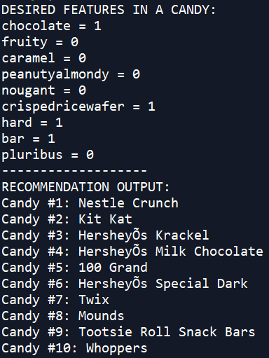

# Candy-Recommendation-Using-Nearest-Neighbors
Unsupervised Machine Learning: What Candy do you Fancy Today? 

Introduction
------------------------------
Lets say you desire a candy that's chocolaty, contained almonds, and had caramel. Furthermore, lets say you had to choose from 100 different candies. It would be tedious and time-consuming to sort through each one.

The simple solution to this problem is to perform a Nearest Neighbor Search. The user will choose the characteristics they desire in a candy from a predifined set of features. The featuers from the user input will then be compared with its Nearest Neighbors in the feature space. The program will output the n nearest neighbors.

Interpertation of the Results
-----------------------------
The nearest neighbors algorithm finds the closest points from a query point. Since these objects are close together in the feature space, we can assume that the query point and the points around it have somewhat similar feature values; as a result, there is a degree of similarity between those points.

The Dataset
-----------------------------
The Dataset is obtained from: https://www.kaggle.com/fivethirtyeight/the-ultimate-halloween-candy-power-ranking

The project uses all the features except for the final 3.

FEATURES:

chocolate: Does it contain chocolate?

fruity: Is it fruit flavored?

caramel: Is there caramel in the candy?

peanutalmondy: Does it contain peanuts, peanut butter or almonds?

nougat: Does it contain nougat?

crispedricewafer: Does it contain crisped rice, wafers, or a cookie component?

hard: Is it a hard candy?

bar: Is it a candy bar?

pluribus: Is it one of many candies in a bag or box?

sugarpercent: The percentile of sugar it falls under within the data set.

pricepercent: The unit price percentile compared to the rest of the set.

winpercent: The overall win percentage according to 269,000 matchups.

